# miorgeminirag
miorgeminirag : Insurance Chat Assistant # RAG # MongoDB Atlas # Google Cloud # Langchain # Angular

## Objective
- To create RAG Chat Assistant with MongoDB Atlas Vector Search, Google Cloud and Langchain
- Send chat prompt requests with Gemini 2.0 Flash.
- Convert PDF documents to vector embeddings with Langchain and Vertex AI Text embeddings API.
- Store and index vector embeddings in MongoDB Atlas.
- Implement Retrieval Augmented Generation (RAG) for context-aware chatbot responses.
- To demo chatbot assistant using retrieval augmented generation

## MiorGeminiRAG Insurance Chat Assistant

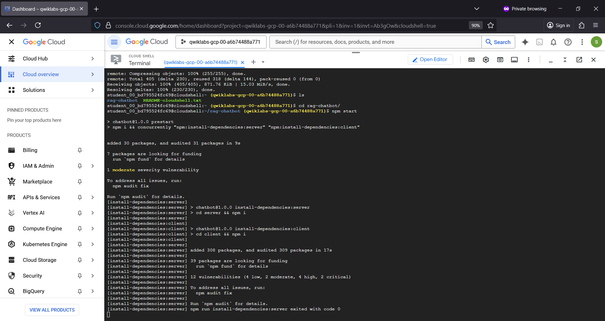

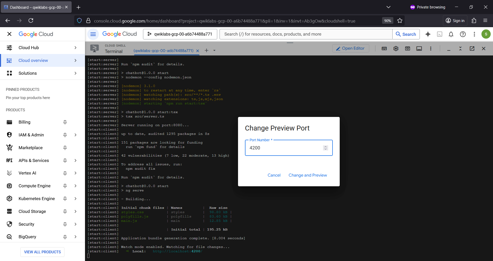

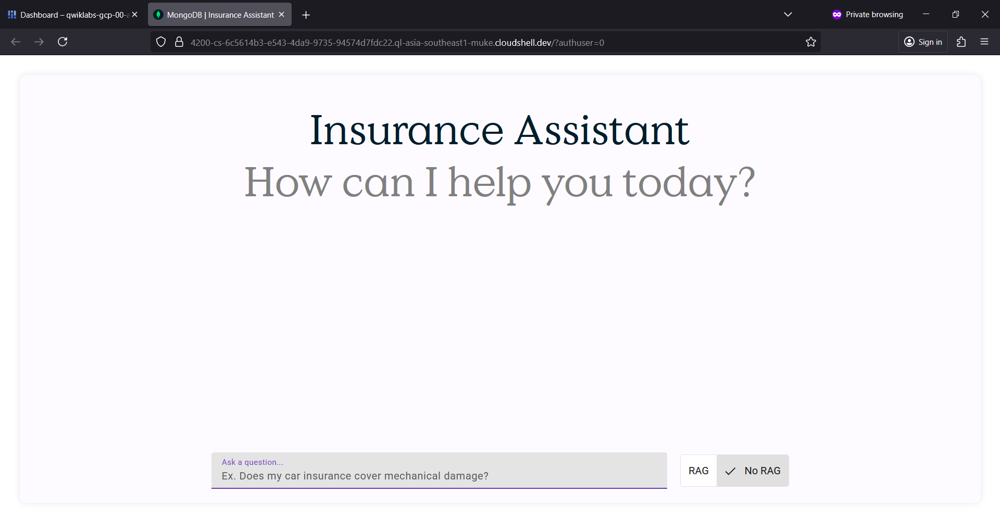

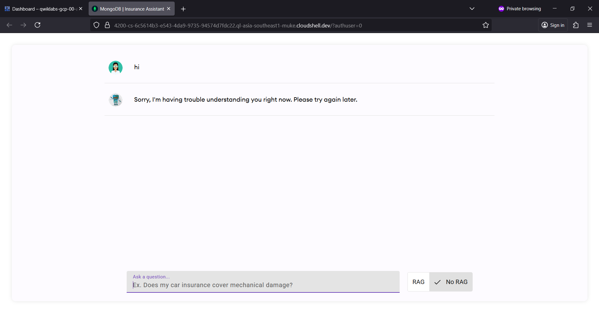

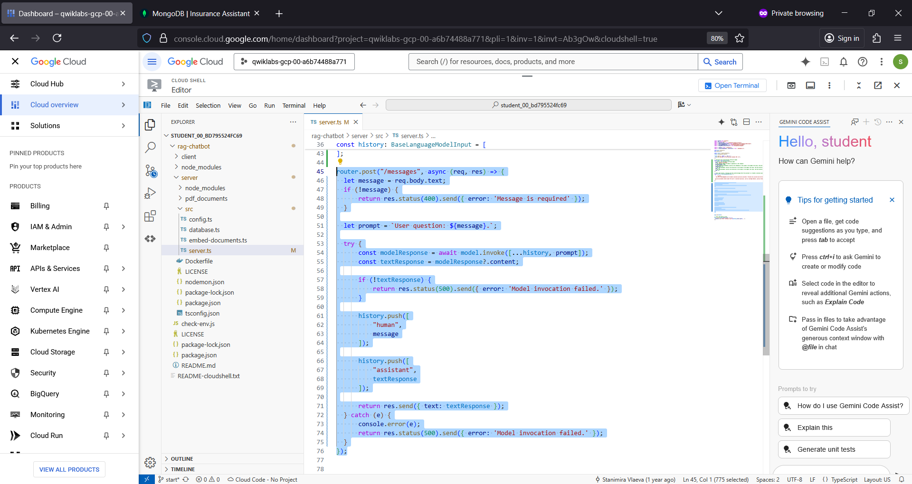

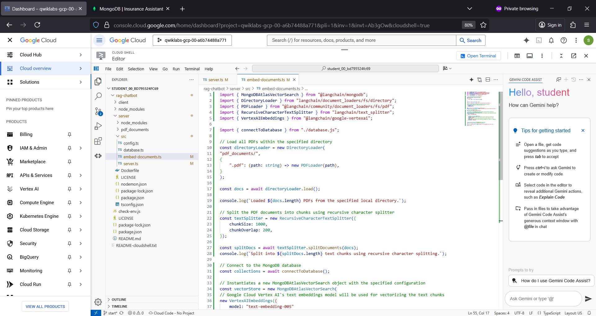

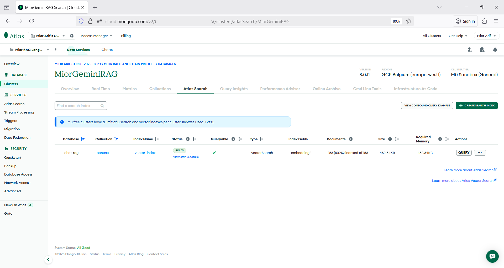

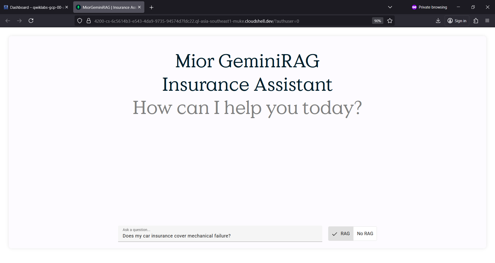

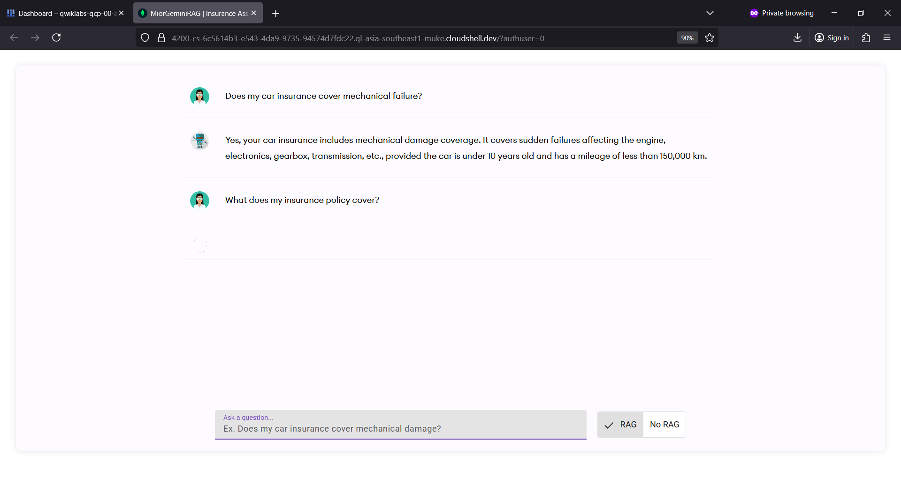

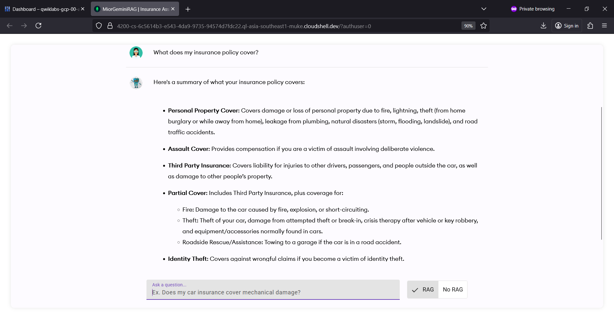

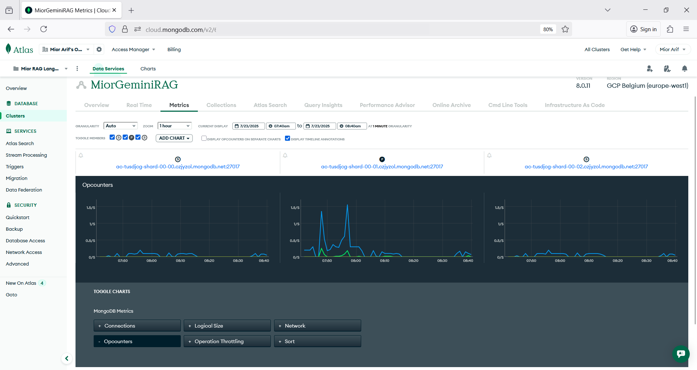
